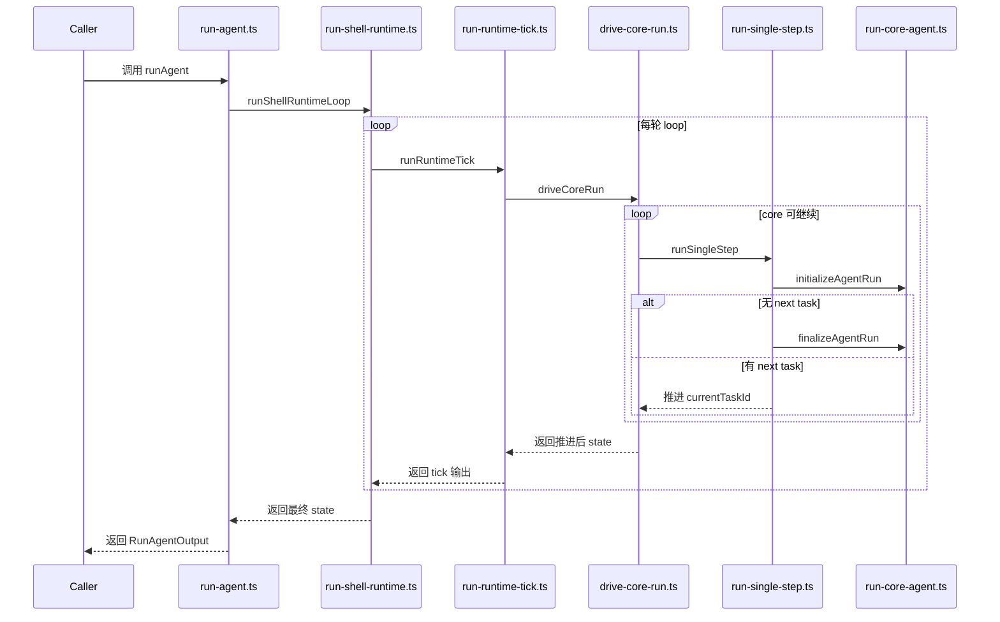
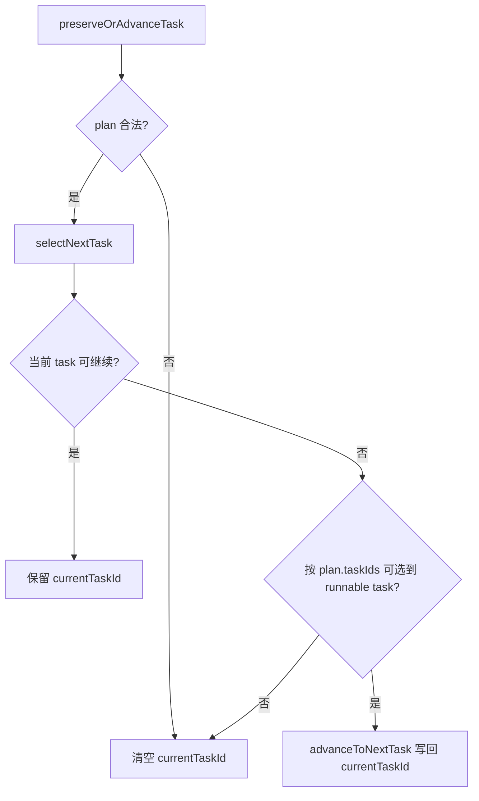
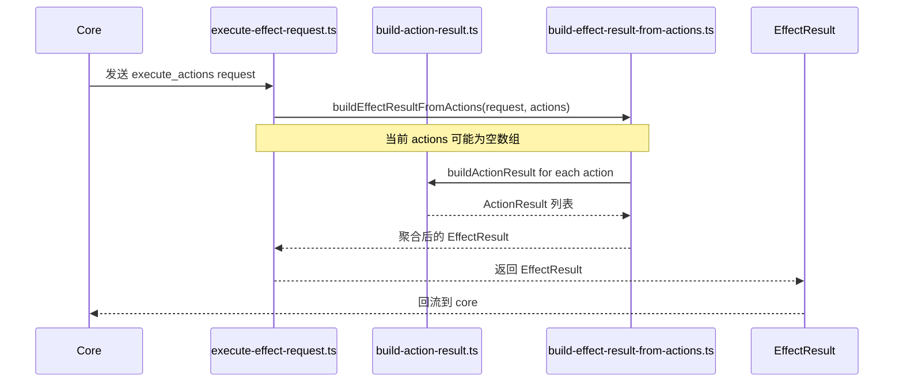
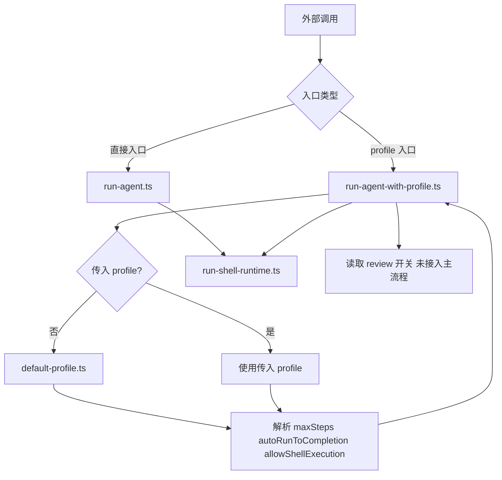

# Core Runtime Visual Model

这份文档用于帮助读者快速建立当前 TypeScript agent 项目的运行时心智模型。它不替代源码阅读，而是提供一条更短的理解路径。本文聚焦当前已经落地的主线：run / step / tick 推进、shell result bridge、以及 profile 接入方式。文档内容描述的是当前实现状态，而不是未来规划。

## 2. 本文聚焦范围

本文当前覆盖四个方面：core run 推进、task / plan 与 currentTaskId 关系、shell 的 action-result / effect-result 桥接、app/profile 的接入点。本文不展开真实 action 执行器、review orchestration、repair / replan、以及更细粒度的场景化 profile 设计。

## 图一：run / step / tick 推进图

这张图回答的问题：一次运行是如何从 app 入口经过 shell 与 core，被 step 和 tick 持续推进的？

`run-core-agent.ts` 是 run 生命周期骨架，负责最小初始化与收尾。`run-single-step.ts` 是单步推进编排，把“准备、任务推进、收尾判断”放到一次 step。`run-runtime-tick.ts` 位于 step 之外，负责把 core 推进与 effect 输入输出拼成单次 tick。`drive-core-run.ts` 承担简单循环驱动，重复执行 step 直到稳定或达到上限。`run-shell-runtime.ts` 则是 core 与 shell 之间的轮转层，负责在每轮中承接 tick 输出并组织下一轮输入。

关联源文件：
- `src/app/run-agent.ts`
- `src/shell/run-shell-runtime.ts`
- `src/core/run-runtime-tick.ts`
- `src/core/drive-core-run.ts`
- `src/core/run-single-step.ts`
- `src/core/run-core-agent.ts`

## 图二：task / plan / currentTaskId 图

这张图回答的问题：task 指针如何在 plan 约束下被保留、切换或清空？

这张图只解释 task 指针推进，不解释整个 runtime loop。`select-next-task.ts` 负责“选”，核心是判断当前 task 是否可继续，以及是否能按 `plan.taskIds` 找到下一个 runnable task。`advance-to-next-task.ts` 负责“写回 state”，把选中的 task id 写回 `currentTaskId`。如果 plan 不可用或找不到 runnable task，路径会回到清空指针，避免状态悬挂。该层与 run/step/tick 层解耦，便于独立阅读和替换策略。

关联源文件：
- `src/core/select-next-task.ts`
- `src/core/advance-to-next-task.ts`
- `src/protocol/task.ts`
- `src/protocol/plan.ts`
- `src/protocol/agent-state.ts`

## 图三：shell action -> effect result 桥接图

这张图回答的问题：shell 如何把 `execute_actions` 请求走过 ActionResult 聚合路径并返回 EffectResult？

这仍不是“真实 action 执行器”，当前阶段没有接入外部执行端。现在的关键变化是 shell 主路径已不再停留在 accepted-only 占位结果，而是显式经过 `Action -> ActionResult -> EffectResult` 桥接分层。即使 action 列表当前可为空，链路形状已经稳定，后续可在不改协议边界的前提下替换执行实现。这个分层让 shell 更容易从占位逻辑平滑过渡到真实执行逻辑。它是从 placeholder loop 向真实 loop 迈进的一步。

关联源文件：
- `src/shell/execute-effect-request.ts`
- `src/shell/build-action-result.ts`
- `src/shell/build-effect-result-from-actions.ts`
- `src/protocol/action.ts`
- `src/protocol/action-result.ts`
- `src/protocol/effect-result.ts`

## 图四：app / profile 接入图

这张图回答的问题：app 与 profile 当前如何接入主线运行，并影响运行方式？

外部当前可以直接使用 `run-agent.ts`，也可以走 `run-agent-with-profile.ts`。当未传入 profile 时，会回退到 `default-profile.ts` 提供默认运行策略。profile 当前主要影响 `maxSteps`、`autoRunToCompletion`、`allowShellExecution`。`review` 开关已经被读取，但尚未接入主流程分支。当前 profile 仍偏 runtime profile，尚未进入更强的场景化装配。

关联源文件：
- `src/app/run-agent.ts`
- `src/app/run-agent-with-profile.ts`
- `src/profiles/default-profile.ts`
- `src/shell/run-shell-runtime.ts`

## 7. 推荐阅读顺序

1. 先看 protocol 的 `agent-state.ts`、`task.ts`、`plan.ts`：先建立状态对象和任务对象边界，再看流程更容易定位字段含义。
2. 再看 core 的 state / task helper：先理解状态迁移规则与 task 选择规则，后续循环代码才容易读通。
3. 再看 `run-single-step.ts`、`drive-core-run.ts`、`run-runtime-tick.ts`：把前面的局部规则放进 step、loop、tick 三层执行节拍中。
4. 再看 shell 的 `build-action-result.ts`、`build-effect-result-from-actions.ts`、`execute-effect-request.ts`：理解 shell 如何把 action 结果聚合为 effect 结果。
5. 最后看 app/profile 接入文件：在理解内核路径后，再看入口封装和 profile 约束会更直观。

## 8. 当前模型的边界

- 真实 action 执行器尚未接入。
- review orchestration 尚未进入主流程。
- repair / replan 尚未实现。
- 场景化 profile 尚未实现。
