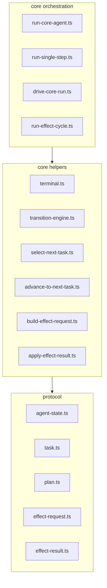
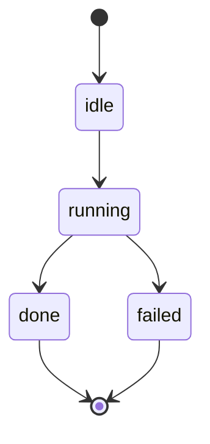
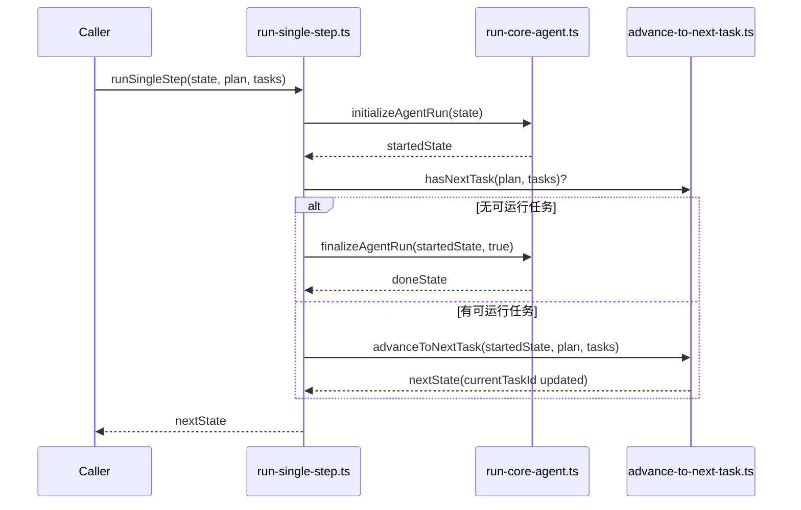
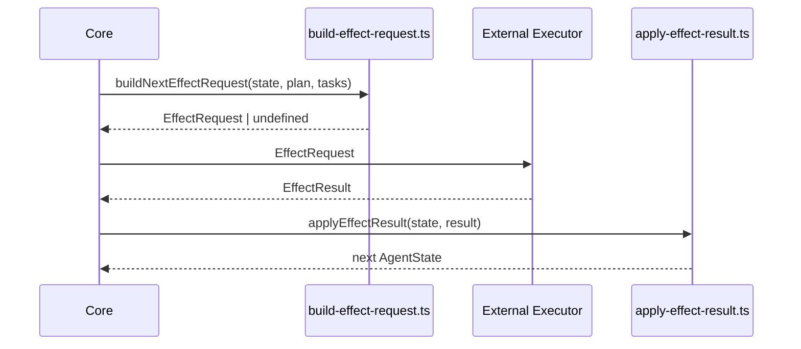

# Core Runtime Visual Model

这份文档用于帮助读者快速建立当前项目的运行时心智模型。它不替代源码阅读，而是提供结构化的导航视角。内容聚焦三件事：结构分层、状态变化、主流程闭环。所有结论均基于当前已存在的 protocol/core 文件。

## 2. 建议维护的可视化目录结构

- `docs/architecture/01-agent_architecture_glossary.md`：维护术语与边界定义，统一阅读语言。
- `docs/architecture/02-core_runtime_visual_model.md`：维护当前 runtime visual model，聚焦结构、状态、流程。
- `docs/architecture/03-protocol_reference.md`：维护 protocol 对象与字段参考，不与 glossary 重复。
- `docs/architecture/04-effect_boundary.md`：单独细化 effect request/result 的边界与约束。
- `docs/architecture/05-state_machine.md`：维护状态机规则与迁移条件的集中说明。

当前文档负责 runtime visual model；glossary 负责术语；protocol reference 负责对象定义；effect boundary 可以在后续单独细化，不在本文件展开。

## 3. 推荐维护的 5 张核心图

### 图 1：分层与文件职责图

这张图回答的问题：这些文件分别在系统里扮演什么角色？



读图时先看三层分工，再看依赖方向。orchestration 负责流程编排，helpers 负责小型纯函数能力，protocol 提供跨文件统一对象与边界类型。

### 图 2：AgentState 状态流转图

这张图回答的问题：一次 run 在状态层面怎么变化？



`transition-engine.ts` 提供最小迁移规则；`run-core-agent.ts` 在启动/收尾中推动状态变化；`apply-effect-result.ts` 在失败结果回流时也可能推进到 `failed`。`done` 和 `failed` 是终态。

### 图 3：单步推进时序图

这张图回答的问题：一次 single step 内部到底发生了什么？



阅读时重点看“先准备运行，再决定结束或推进任务”。该时序不涉及 shell，仅表达 core 内单步纯逻辑。

### 图 4：任务选择与推进图

这张图回答的问题：task 指针是如何被设置、保留或清空的？

```mermaid
flowchart TD
  A[preserveOrAdvanceTask] --> B[selectNextTask(state, plan, tasks)]
  B --> C{plan 存在且合法?}
  C -- 否 --> Z[clear currentTaskId]
  C -- 是 --> D{currentTaskId 对应任务可继续?}
  D -- 是 --> E[保留 currentTaskId]
  D -- 否 --> F[按 plan.taskIds 顺序查找 runnable task]
  F --> G{找到可运行 task?}
  G -- 是 --> H[advanceToNextTask 设置 currentTaskId]
  G -- 否 --> Z
```

先尝试保留当前任务，再按 `plan.taskIds` 顺序选择下一个可运行任务；如果仍选不到，则清空 `currentTaskId`，避免悬挂指针。

### 图 5：Effect 边界闭环图

这张图回答的问题：effect request 和 effect result 在架构中如何闭环？



当前项目中 External Executor 仍未真正实现；现阶段目标是先在 core 内明确 request/result 的输入输出闭环，以便后续接入 shell 执行层。

## 4. 文件阅读顺序建议

1. 先读 protocol 基础对象（`agent-state.ts`、`task.ts`、`plan.ts`、`effect-request.ts`、`effect-result.ts`）：先建立数据边界，后续流程才有参照。
2. 再读状态迁移（`terminal.ts`、`transition-engine.ts`）：先理解哪些状态可变、何时终止。
3. 再读 task 选择与推进（`select-next-task.ts`、`advance-to-next-task.ts`）：先看任务指针如何被保留、切换、清空。
4. 再读单步运行（`run-core-agent.ts`、`run-single-step.ts`、`drive-core-run.ts`）：把状态与任务逻辑放进最小执行节拍。
5. 最后读 effect request/result 闭环（`build-effect-request.ts`、`apply-effect-result.ts`、`run-effect-cycle.ts`）：理解 core 与外部执行层的桥接接口。

## 5. 当前模型的边界

当前文档刻意不覆盖以下内容：

- shell 尚未真正接入，本文不描述外部执行层实现细节。
- 还没有真实 action execution，只有 core 内的最小 request/result 闭环。
- 还没有 review orchestration 的完整运行编排。
- 还没有 repair / replan 流程的实际驱动逻辑。
