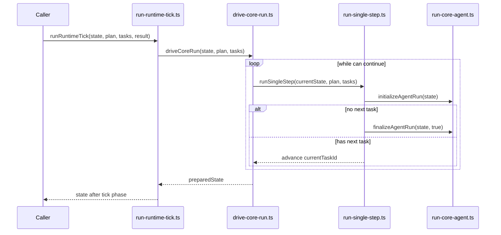
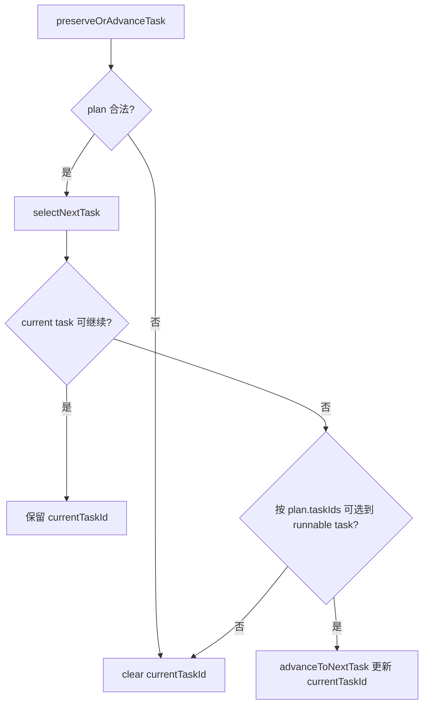
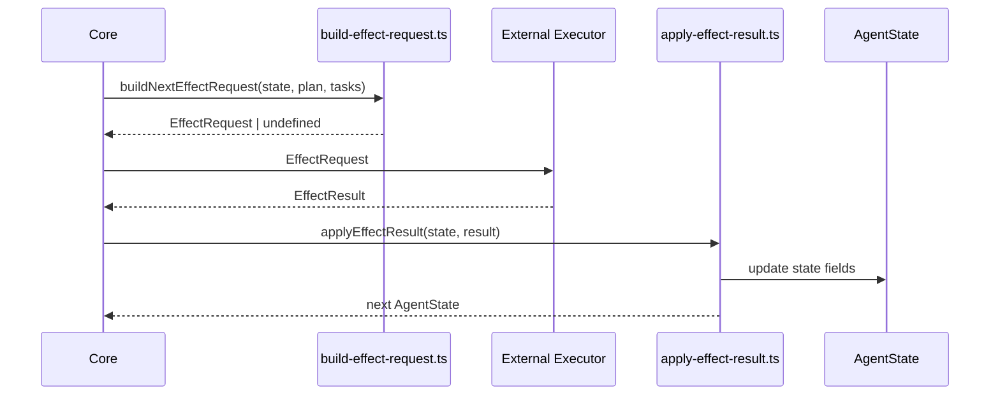

# Core Runtime Visual Model

这份文档用于帮助读者快速建立当前 core 运行时的心智模型。它不替代源码，而是提供一个阅读源码前的结构化入口。本文只聚焦三件事：run/step 的推进、task/plan 的选择与推进、effect cycle 的请求与回流。

## 2. 本文聚焦范围

本次文档只围绕三张图展开：run/step 图、task/plan 图、effect 闭环图。本文不展开 glossary，不提供完整 protocol 字段参考，也不讨论 shell 侧细节。repair / replan 也不在当前范围内。

## 图一：run / step 推进图

这张图回答的问题：一次 run 是如何通过 step 被推进的？

`run-core-agent.ts` 更像 run 生命周期骨架，负责最小初始化与收尾。`run-single-step.ts` 更像单步推进编排，在一个 step 内串起准备与推进逻辑。`drive-core-run.ts` 更像循环驱动层，控制 step 重复执行直到稳定或达到上限。`run-runtime-tick.ts` 把这些能力放到一次 tick 入口里。这个图刻意不展开 effect request/result，目的是先看清 run 本身如何前进。

关联源文件：
- `src/core/run-core-agent.ts`
- `src/core/run-single-step.ts`
- `src/core/drive-core-run.ts`
- `src/core/run-runtime-tick.ts`

## 图二：task / plan 选择与推进图

这张图回答的问题：task 在 plan 中如何被选择，并写回到 state？

`select-next-task.ts` 负责“选”，核心是先看当前 task 能否继续，再按 `plan.taskIds` 顺序找 runnable task。`advance-to-next-task.ts` 负责“写回 state”，即把选中的 task id 写入 `currentTaskId`，或在选不到时清空。这个层面只关心 task 指针，不负责 run 生命周期。也就是说，task/plan 图与 run/step 图是不同抽象层：前者是局部选择逻辑，后者是整体推进节拍。把两者分开看，代码职责会更清楚。

关联源文件：
- `src/core/select-next-task.ts`
- `src/core/advance-to-next-task.ts`
- `src/protocol/task.ts`
- `src/protocol/plan.ts`
- `src/protocol/agent-state.ts`

## 图三：effect 闭环图

这张图回答的问题：effect request 如何发出，effect result 如何回流到 state？

当前 external executor 还没有真正实现，图中的执行侧是预留边界。现有代码已经先把 request/result 闭环定义出来，保证 core 可以先完成输入输出形状。`build-effect-request.ts` 负责从当前状态构造请求，`apply-effect-result.ts` 负责把结果回写到 `AgentState`。成功 result 与失败 result 对 state 的影响不同，至少会体现在任务指针清理与失败状态推进上。`run-effect-cycle.ts` 负责把这两侧串起来，形成最小闭环。

关联源文件：
- `src/core/build-effect-request.ts`
- `src/core/apply-effect-result.ts`
- `src/core/run-effect-cycle.ts`
- `src/protocol/effect-request.ts`
- `src/protocol/effect-result.ts`

## 6. 推荐阅读顺序

1. 先看 `src/protocol/agent-state.ts`、`src/protocol/task.ts`、`src/protocol/plan.ts`：先建立运行对象和最小数据边界，再看流程才不容易混淆。
2. 再看 `src/core/transition-engine.ts` 和 `src/core/terminal.ts`：先理解状态能不能变、何时视为终态。
3. 再看 `src/core/select-next-task.ts` 与 `src/core/advance-to-next-task.ts`：先看 task 是如何被选择并写回 state。
4. 再看 `src/core/run-single-step.ts`、`src/core/drive-core-run.ts`：把前面的状态与任务逻辑放进 step 和循环驱动里。
5. 最后看 `src/core/build-effect-request.ts`、`src/core/apply-effect-result.ts`、`src/core/run-effect-cycle.ts`：理解 core 与外部执行边界如何形成 request/result 闭环。

## 7. 当前模型的边界

- shell 尚未真正接入。
- 真实 action execution 尚未展开。
- review orchestration 尚未展开。
- repair / replan 尚未展开。
