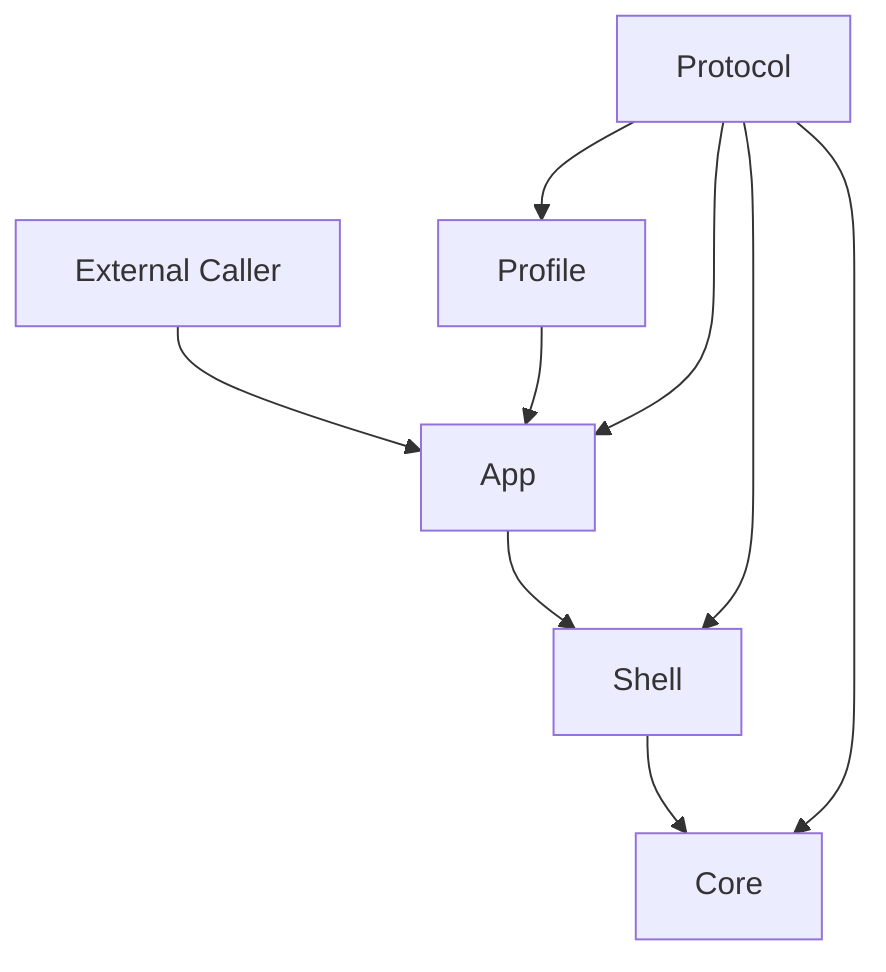

# Core / Shell / Profile Architecture Spec

本文描述当前仓库的整体分层架构与协作关系。文档聚焦当前已经实现的五层基线，而不是未来完整 agent 平台的总设计。内容以当前代码可对照的文件为准，避免把预留能力写成已落地实现。建议结合 `01-agent_architecture_glossary.md` 与 `02-core_runtime_visual_model.md` 一起阅读。

## 2. 当前架构基线

当前仓库采用的是五层基线：Protocol、Core、Shell、App、Profile。

之所以不是仅写 Core / Shell / Profile 三层，是因为 Protocol 已经作为共享数据层独立存在，承担跨层对象与守卫定义；同时 App 已经作为运行入口层独立存在，负责对外调用封装。

本文描述的是当前实现态，不代表最终形态。

## 3. 五层总览

| 层 | 当前职责 | 当前代表文件 | 不负责的内容 |
|---|---|---|---|
| Protocol | 定义共享协议对象、`kind/success/payload/context` 等跨层结构与守卫 | `src/protocol/agent-state.ts` `src/protocol/action.ts` `src/protocol/effect-request.ts` `src/protocol/effect-result.ts` | 不负责任何运行编排或执行循环 |
| Core | 定义 run/step/tick 推进语义、task 指针推进、effect 请求与结果吸收逻辑 | `src/core/run-single-step.ts` `src/core/drive-core-run.ts` `src/core/run-runtime-tick.ts` | 不直接做 shell 执行与外部调用 |
| Shell | 承接 effect request，构造 action/effect 结果并驱动外层 runtime loop | `src/shell/execute-effect-request.ts` `src/shell/build-action-result.ts` `src/shell/run-shell-runtime.ts` | 不定义 task 选择语义和 core 状态机语义 |
| App | 提供对外运行入口与调用包装 | `src/app/run-agent.ts` `src/app/run-agent-with-profile.ts` | 不定义协议对象，不实现 shell/core 细节 |
| Profile | 提供运行约束对象与默认策略 | `src/profiles/default-profile.ts` | 当前不等于完整场景装配平台 |

## 分层关系图

External Caller 当前通过 App 层发起运行。App 会接入 Profile 约束，并将运行委托给 Shell。Shell 在每轮中驱动 Core 的推进与结果回流。Core、Shell、App、Profile 都共享 Protocol 中的标准化对象。Profile 当前主要影响运行方式，不直接改写 Core 语义。Protocol 是共享数据层，不承担 orchestration 职责。

## 当前主线路径

1. 外部调用 app 入口：从 `runAgent` 或 `runAgentWithProfile` 发起一次运行。
2. app 可直接运行，也可通过 profile-based 入口运行：profile 入口会先解析默认或传入 profile 再决定运行方式。
3. shell runtime 负责 loop 轮转：`runShellRuntimeLoop` 在每一轮连接 core 输出与 shell 处理结果。
4. runtime tick 负责 core 内部推进与 result/request 组织：`runRuntimeTick` 先推进 core，再吸收 result，再准备下一条 request。
5. shell 主入口负责 effect request/result 桥接：`executeEffectRequest` 将 request 走入 action/effect result 构造链路并返回 effect result。

## 各层详细说明

### Protocol

1. 当前职责：提供跨层共享的协议对象、守卫与统一导出入口。
2. 当前已实现内容：`AgentState`、`Plan`、`Task`、`Action`、`ActionResult`、`EffectRequest`、`EffectResult` 等对象均已落地；`kind/success/payload/context` 结构已形成统一表达。
3. 当前未实现 / 不负责内容：不负责运行循环、任务调度、外部执行。

### Core

1. 当前职责：定义 run/step/tick 的最小运行语义，维护 task 指针推进和 effect 吸收逻辑。
2. 当前已实现内容：`run-core-agent.ts`、`run-single-step.ts`、`drive-core-run.ts`、`run-runtime-tick.ts` 已形成主线；task 选择与 `currentTaskId` 推进已落地。
3. 当前未实现 / 不负责内容：不负责真实执行器接入，不负责 review/repair/replan 编排。

### Shell

1. 当前职责：将 core 发出的 effect request 桥接为可回流的 effect result，并组织 shell 侧最小 loop。
2. 当前已实现内容：`build-action-result.ts` 与 `build-effect-result-from-actions.ts` 已形成 `Action -> ActionResult -> EffectResult` 桥接；`execute-effect-request.ts` 已接入这条路径。
3. 当前未实现 / 不负责内容：尚未接入真实 action executor，不负责定义 core task 语义。

### App

1. 当前职责：对外暴露稳定运行入口并封装调用参数。
2. 当前已实现内容：`run-agent.ts` 提供基础入口；`run-agent-with-profile.ts` 提供 profile 接入入口。
3. 当前未实现 / 不负责内容：不负责协议定义，不负责 shell/core 内部实现细节。

### Profile

1. 当前职责：提供 runtime 约束对象，影响步数上限和运行方式。
2. 当前已实现内容：`default-profile.ts` 提供默认 profile、克隆与参数解析函数。
3. 当前未实现 / 不负责内容：当前实现仍偏 runtime profile，尚未展开场景化 profile 体系。

## 当前最关键的跨层接口

| 接口 | 所在层 | 作用 |
|---|---|---|
| `AgentState` | Protocol | 表达一次 run 的状态快照并跨层流转 |
| `Plan` | Protocol | 表达任务组织结构与计划约束 |
| `Task` | Protocol | 表达可推进的最小任务单元 |
| `Action` | Protocol | 表达待执行动作 |
| `ActionResult` | Protocol | 表达单个动作结果 |
| `EffectRequest` | Protocol | core 发给 shell 的标准请求 |
| `EffectResult` | Protocol | shell 回流给 core 的标准结果 |
| `runRuntimeTick` | Core | 单次 tick 内组织 core 推进与 request/result 吸收 |
| `executeEffectRequest` | Shell | 承接 effect request 并返回 effect result |
| `runShellRuntimeLoop` | Shell | 轮转执行 shell/runtime 最小闭环 |
| `runAgent` | App | 对外基础运行入口 |
| `runAgentWithProfile` | App | 带 profile 约束的对外运行入口 |

## 当前架构边界

- 真实 action executor 尚未接入。
- review orchestration 尚未进入主线路径。
- repair / replan 尚未落地。
- 场景化 profile 尚未落地。
- middleware / hook / HITL 当前仍不是主线实现。

## 9. 推荐阅读顺序

1. 先读 glossary：先统一术语语义，后续读代码和图更少歧义。
2. 再读 runtime visual model：先建立 run/step/tick 与 effect 闭环的总体心智模型。
3. 再读 protocol 层文件：先掌握跨层对象结构，便于理解后续函数输入输出。
4. 再读 core 层关键文件：理解状态推进、task 指针和 tick 组织逻辑。
5. 再读 shell 层关键文件：理解 request/result 如何桥接并进入 loop。
6. 最后读 app/profile 入口：把前面分层能力映射到对外可调用入口。
